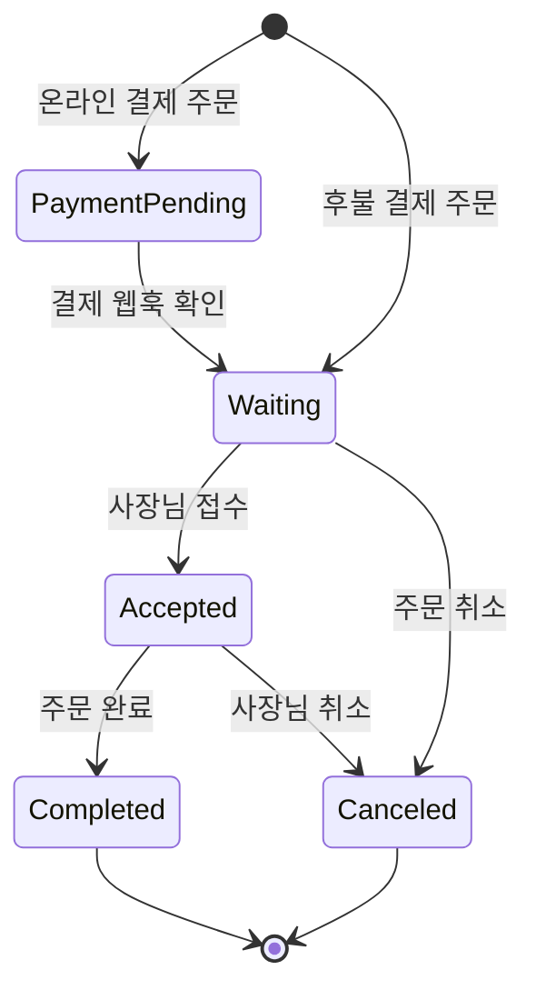

# 주문이요


주문이요는 고객, 음식점 사장님, 관리자가 하나의 서비스 안에서 주문 전 과정을 처리할 수 있도록 만든 배달 주문 플랫폼입니다.

고객은 주변 음식점을 찾고 메뉴와 옵션을 선택해 주문할 수 있습니다. 사장님은 들어온 주문을 접수하고 완료 처리하며, 관리자는 음식점 승인·신고·문의·서비스 통계를 관리합니다. 회원 유형에 따라 필요한 기능을 나누고, 주문 상태가 바뀌는 과정을 하나의 흐름으로 연결하는 데 초점을 맞췄습니다.

이 저장소에는 Spring Boot 백엔드와 배포용 React 정적 빌드 파일이 함께 들어 있습니다.

## 주요 기능

### 고객

- 일반 회원가입과 로그인
- Google, Kakao, Naver 소셜 로그인
- 이메일 인증을 이용한 아이디·비밀번호 찾기
- 프로필과 배송지 관리
- 주소와 음식 카테고리를 기준으로 음식점 조회
- 메뉴·옵션 선택, 쿠폰·마일리지를 반영한 주문
- 진행 중인 주문과 완료·취소 주문 내역 조회
- 음식점 찜 등록·해제
- 리뷰 작성·수정·삭제 및 리뷰 신고
- 쿠폰 발급과 보유 쿠폰 조회
- 고객센터 문의 작성과 처리 상태 확인

### 음식점 사장님

- 사장님 회원가입과 음식점 등록
- 음식점 정보, 영업 상태, 이미지, 카테고리 관리
- 메뉴 카테고리·메뉴·옵션 관리
- 새 주문 확인, 주문 접수·취소·완료 처리
- 주문 발생 시 SSE 알림 수신
- 리뷰 답글 관리
- 쿠폰 생성과 발급 현황 조회
- 일·월 단위 매출과 주문 건수 조회

### 관리자

- 등록 대기 음식점 조회와 승인
- 서비스 공통 음식 카테고리 관리
- 고객 문의 조회와 답변
- 리뷰 신고 처리와 사용자 이용 정지
- 전체 음식점 기준 매출·주문·가입·탈퇴 통계 조회

## 담당 기능

팀 프로젝트에서 이민엽은 `lmy` 패키지의 주문, 완료 주문, 음식점 찜 기능을 담당했습니다.

### 1. 주문 생성과 금액 계산

- 로그인 사용자, 음식점, 메뉴와 옵션 정보를 조회해 주문 데이터를 구성했습니다.
- 주문 시점의 메뉴명·가격과 옵션명·가격을 `OrderMenu`, `OrderMenuOption`에 함께 저장했습니다. 이후 음식점이 메뉴 정보를 바꾸더라도 기존 주문에 적용된 정보를 구분할 수 있습니다.
- 메뉴 수량과 옵션 가격을 합산한 뒤 쿠폰과 마일리지를 반영해 최종 결제 금액을 계산합니다.
- 결제 수단, 요청사항 길이, 쿠폰의 발급 음식점·소유자·최소 주문금액, 마일리지 사용 조건을 검증하도록 구성했습니다.
- 주문 생성부터 사용자 마일리지와 쿠폰 상태 변경까지 하나의 트랜잭션으로 처리합니다.

### 2. 주문 상태 관리

현재 주문은 `order`, 종료된 주문은 `done_order` 계열 테이블에서 관리합니다.



코드에서 사용하는 상태값은 다음과 같습니다.

| 구분 | 상태값 | 의미 |
| --- | ---: | --- |
| 진행 주문 | `1` | 온라인 결제 확인 전 |
| 진행 주문 | `2` | 결제 확인 후, 사장님 접수 전 |
| 진행 주문 | `3` | 사장님 접수 완료 |
| 종료 주문 | `1` | 주문 완료 |
| 종료 주문 | `2` | 주문 취소 |

- 온라인 결제는 PortOne 웹훅으로 결제 정보를 조회한 뒤 주문 상태를 변경합니다.
- 후불 결제 주문은 생성 즉시 사장님 접수 대기 상태로 전환합니다.
- 접수 대기 주문이 생기면 사장님 계정에 연결된 `SseEmitter`로 알림을 보냅니다.
- 주문 완료나 취소 시 주문 내용을 `DoneOrder`로 옮긴 뒤 진행 주문을 삭제합니다.
- 취소된 주문에 쿠폰이 적용돼 있었다면 쿠폰을 다시 사용할 수 있는 상태로 되돌립니다.

### 3. 주문 내역 조회

- 고객은 자신의 진행 주문과 완료·취소 내역을 조회할 수 있습니다.
- 사장님은 자신의 음식점에 들어온 접수 전·접수 후·완료·취소 주문을 구분해 조회할 수 있습니다.
- 주문 상세 조회 시 고객 또는 해당 음식점 사장님인지 확인합니다.
- 완료 주문 목록은 최신순으로 페이징하고, 주문 메뉴 정보와 리뷰 작성 여부를 함께 반환합니다.
- 목록 조회에는 DTO projection을 사용해 화면에 필요한 값만 조합했습니다.

### 4. 음식점 찜

- 사용자와 음식점의 기존 찜 데이터를 조회해 등록과 해제를 하나의 토글 API로 처리했습니다.
- 중복 찜 데이터를 별도로 만들지 않고 기존 관계의 유무에 따라 저장 또는 삭제합니다.
- Controller, Service, 통합 테스트를 나눠 정상 등록·정상 해제·존재하지 않는 음식점 요청을 검증했습니다.

## 기술 스택

| 영역 | 사용 기술 |
| --- | --- |
| Language | Java 17 |
| Framework | Spring Boot 3.3.1, Spring MVC, Spring Security |
| Authentication | JWT, OAuth 2.0, BCrypt |
| Database | MariaDB, Spring Data JPA, Hibernate, MyBatis |
| Cache / 인증번호 저장 | Redis |
| API / 통신 | REST API, SSE, WebClient |
| External API | PortOne, VWorld, Google·Kakao·Naver OAuth |
| Documentation | Springdoc OpenAPI, Swagger UI |
| Test | JUnit 5, Mockito, MockMvc, Spring Boot Test |
| Build | Gradle |
| Frontend artifact | React 정적 빌드 파일 |

## 구성

요청은 Controller에서 받고, 도메인 규칙은 Service에서 처리합니다. 데이터 변경과 단순 조회에는 JPA Repository를 사용하고, 통계나 여러 테이블을 조합하는 조회에는 JPQL·Native Query·MyBatis XML Mapper를 함께 사용했습니다.

| 구성 요소 | 역할 |
| --- | --- |
| React 정적 파일 | 사용자 화면. Spring Boot의 `static` 경로에서 제공합니다. |
| Spring MVC | REST API와 파일 업로드 요청을 처리합니다. |
| Spring Security | JWT 필터, OAuth 로그인, 메서드 단위 권한 검사를 담당합니다. |
| MariaDB | 사용자, 음식점, 메뉴, 주문, 리뷰, 쿠폰 등 주요 데이터를 저장합니다. |
| Redis | 이메일 인증번호처럼 만료 시간이 필요한 데이터를 저장합니다. |
| SSE | 주문 요청 알림을 사장님에게 전달합니다. |
| WebClient | 결제 정보와 주소 좌표 등 외부 API 데이터를 조회합니다. |

### 프로젝트 구조

```text
src
├── main
│   ├── java/com/green/beadalyo
│   │   ├── common        # 공통 설정, 파일 처리, 예외 응답
│   │   ├── gyb           # 음식점, 카테고리, 결제, SSE, 외부 데이터
│   │   ├── jhw           # 회원, 주소, 이메일, 인증·인가, 메뉴 카테고리
│   │   ├── kdh           # 메뉴·옵션, 음식점 승인, 문의, 신고, 통계
│   │   ├── lhn           # 리뷰와 쿠폰
│   │   └── lmy           # 주문, 완료 주문, 음식점 찜
│   └── resources
│       ├── mappers       # MyBatis XML Mapper
│       ├── static        # React 배포 빌드와 정적 리소스
│       └── application.yaml
└── test/java/com/green/beadalyo
    └── ...               # Controller, Service, 통합 테스트
```

각 기능 패키지는 필요에 따라 다음 구조를 사용합니다.

```text
domain
├── Controller
├── Service
├── Repository
├── Entity
└── request / response / model
```

## 대표 API

전체 API 명세는 애플리케이션 실행 후 Swagger UI에서 확인할 수 있습니다.

| 기능 | Method | Endpoint |
| --- | --- | --- |
| 일반 회원가입 | `POST` | `/api/sign-up` |
| 사장님 회원가입 | `POST` | `/api/owner/sign-up` |
| 로그인 | `POST` | `/api/sign-in` |
| 음식점 목록 조회 | `GET` | `/api/restaurant` |
| 음식점 상세 조회 | `GET` | `/api/restaurant/{seq}` |
| 주문 생성 | `POST` | `/api/order/` |
| 사장님 주문 접수 | `PATCH` | `/api/order/owner/confirm/{order_pk}` |
| 주문 완료 | `PUT` | `/api/order/owner/done/{order_pk}` |
| 주문 취소 | `PUT` | `/api/order/cancel/list/{order_pk}` |
| 고객 완료 주문 내역 | `GET` | `/api/done/user/list` |
| 음식점 찜 토글 | `PUT` | `/api/follow/toggle/{res_pk}` |
| 리뷰 작성 | `POST` | `/api/rev` |
| 사용자 쿠폰 발급 | `POST` | `/api/coupons/{couponId}` |
| SSE 연결 | `GET` | `/sse?token={accessToken}` |
| 결제 웹훅 | `POST` | `/payment/webhook` |

API 응답은 대부분 아래 형식으로 통일했습니다.

```json
{
  "statusCode": 1,
  "resultMsg": "정상처리 되었습니다.",
  "resultData": {}
}
```

## 로컬 실행

### 1. 준비 사항

- JDK 17
- MariaDB
- Redis
- 외부 기능을 확인하려면 OAuth, SMTP, PortOne 설정값

### 2. 환경변수 설정

프로젝트 루트에 `.env` 파일을 만들고 다음 값을 설정합니다. 실제 비밀번호와 API 키는 저장소에 커밋하지 않습니다.

```dotenv
DEFAULT.DB_URL=jdbc:log4jdbc:mariadb://localhost:3306/baedalyo
DEFAULT.DB_USERNAME=your_database_username
DEFAULT.DB_PASSWORD=your_database_password

DEFAULT.REDIS.HOST=localhost
DEFAULT.REDIS.PORT=6379
DEFAULT.FILE_DIRECTORY=./uploads

JWT_SECRET=replace_with_a_sufficiently_long_random_secret

MAIL.USERNAME=your_mail_username
MAIL.PASSWORD=your_mail_password

SOCIAL.GOOGLE.CLIENT_ID=your_google_client_id
SOCIAL.GOOGLE.SECRET=your_google_client_secret
SOCIAL.KAKAO.CLIENT_ID=your_kakao_client_id
SOCIAL.KAKAO.SECRET=your_kakao_client_secret
SOCIAL.NAVER.CLIENT_ID=your_naver_client_id
SOCIAL.NAVER.SECRET=your_naver_client_secret

PAYMENT.SECRET=your_portone_api_secret
```

업로드 경로로 지정한 디렉터리는 애플리케이션이 읽고 쓸 수 있어야 합니다. OAuth 로그인을 사용한다면 각 공급자 콘솔의 Redirect URI도 실행 주소에 맞게 등록해야 합니다.

### 3. 실행

macOS 또는 Linux:

```bash
./gradlew bootRun
```

Windows:

```powershell
.\gradlew.bat bootRun
```

기본 포트는 `8080`입니다.

- 애플리케이션: `http://localhost:8080`
- Swagger UI: `http://localhost:8080/swagger`

## 테스트

```bash
./gradlew test
```

테스트 코드는 단위 테스트와 Spring 통합 테스트를 함께 사용합니다. 음식점 찜 기능은 다음 범위를 나눠 검증했습니다.

- Service: 음식점 조회, 찜 관계 조회, 등록, 삭제
- Controller: 등록·해제 응답과 존재하지 않는 음식점 처리
- Integration: 실제 Spring Context에서 찜 등록과 해제 흐름

그 밖에 음식점, 공통 카테고리, 메뉴 카테고리, 사용자 주소, 고객 문의 기능의 테스트가 포함돼 있습니다.

## 구현에서 확인할 수 있는 특징

- JWT 기반의 stateless 인증과 역할별 `@PreAuthorize` 권한 검사
- Google, Kakao, Naver OAuth 로그인 결과를 하나의 사용자 모델로 변환
- JPA 연관관계와 cascade를 이용한 주문·메뉴·옵션 저장
- 주문 완료 시점의 메뉴명과 가격을 별도로 보존하는 주문 이력 모델
- JPQL DTO projection과 Native Query를 이용한 목록·통계 조회
- Redis TTL을 이용한 이메일 인증번호 관리
- SSE를 이용한 사용자별 주문 알림
- SPA 경로 요청을 `index.html`로 연결하고 업로드 이미지는 별도 경로에서 제공
- Swagger 문서에 역할별 API와 응답 코드를 정리

## 저장소 확인 시 참고할 점

- 프론트엔드 소스가 아니라 배포용 React 빌드 결과물이 `src/main/resources/static`에 포함돼 있습니다.
- 데이터베이스 스키마는 JPA의 `ddl-auto: update` 설정을 사용하므로 로컬 개발용 데이터베이스에서 실행하는 것이 안전합니다.
- OAuth 로그인, 메일 발송, 온라인 결제, 주소 좌표 변환은 각 외부 서비스의 유효한 설정값이 있어야 동작합니다.
- API 세부 요청·응답 모델은 실행 중인 Swagger UI와 각 Controller의 명세를 기준으로 확인할 수 있습니다.
